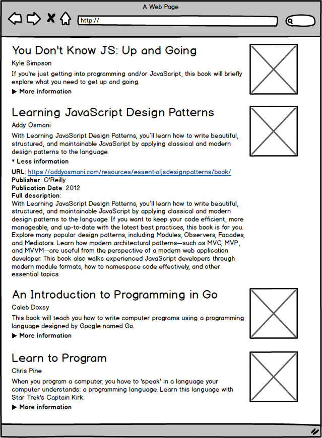

# React Freeshelf

## Directions

Your project for today and tomorrow is to build a single-page application that displays books using React. You should use `create-react-app` to create the application and build up from there.

The finished product will look like the included wireframe. When the information for that book is clicked, the section expands to show additional information about the book. When it is clicked again, it should collapse back to the original view. This behavior is commonly referred to as an accordion, like [this component in Bootstrap](https://getbootstrap.com/docs/4.0/components/collapse/#accordion-example).

The page should display a list of books with a thumbnail display of information for each book, including:

+ title
+ author
+ short description
+ image of the book's cover

The additional information shown in the expanded view should include:

+ url
+ publisher
+ publication date
+ expanded description

Note that you will need to handle cases where not all the data is available. In these cases, make sure your UI design can accommodate missing or problematic data and/or supply placeholder images or text so that your page won't look broken without it.

The books are held in [books.json](books.json). Create React App makes it so that you can import this file and retrieve the data like so:

```
import books from './books.json'
```

## Wireframe


